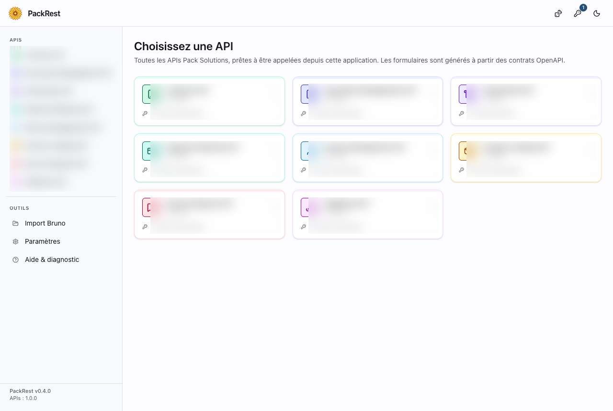
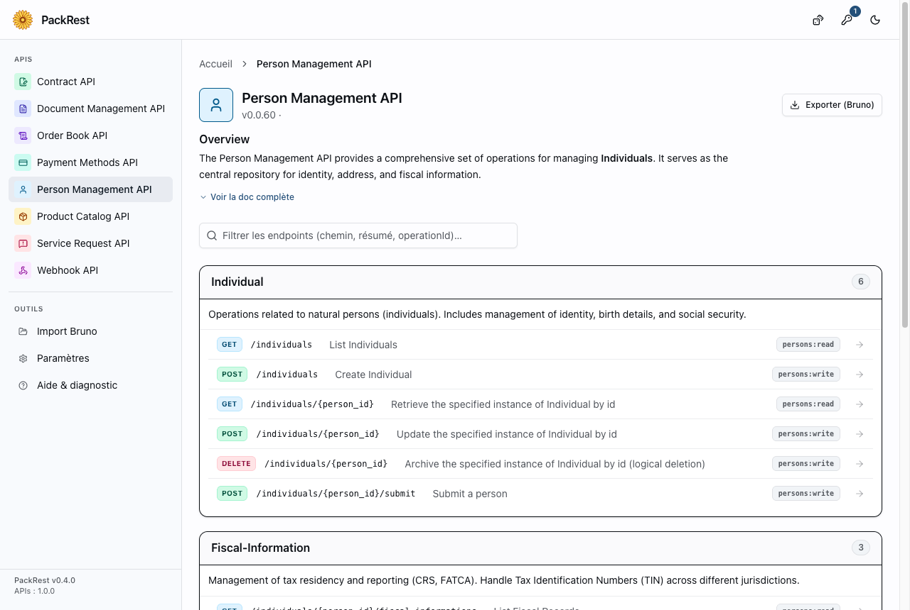
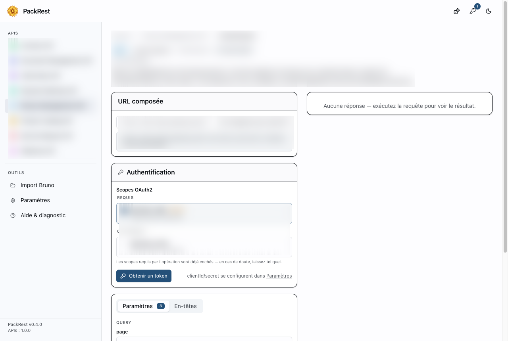
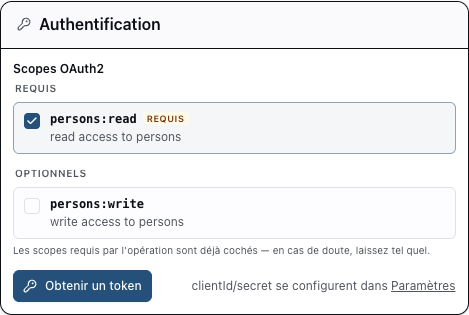
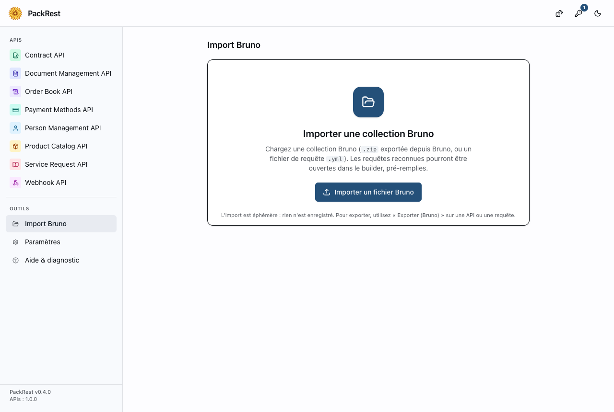
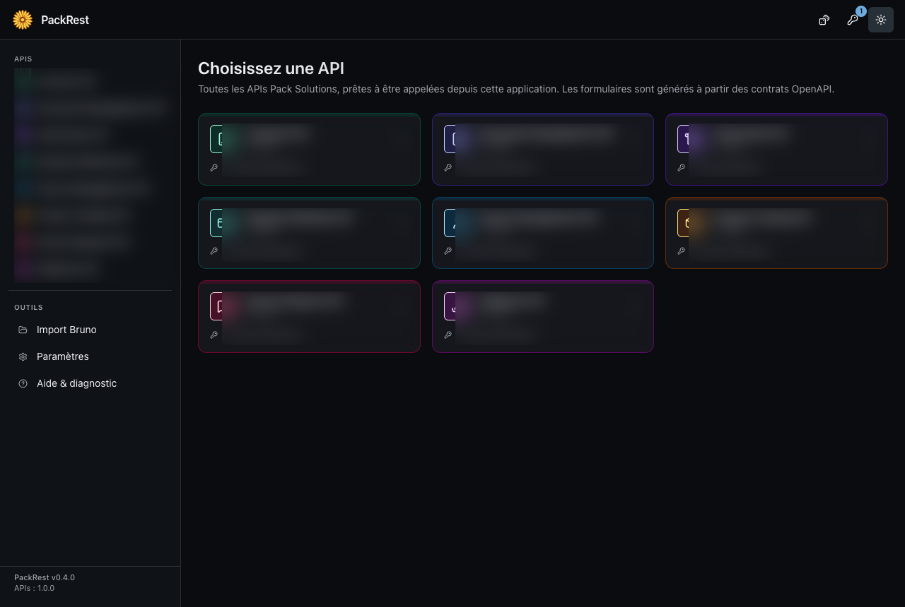
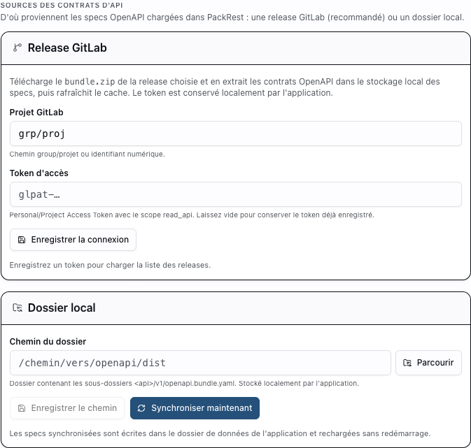

# PackRest

Client REST **de bureau** (application Tauri) pour utilisateurs
non-développeurs. L'app charge les contrats OpenAPI de Pack Solutions et permet
d'exécuter chaque endpoint depuis une fenêtre native : choix de l'API → choix
de l'endpoint → formulaire généré à partir du contrat →
obtention d'un token OAuth2 → exécution → panneau de réponse.



## Points forts

- **Formulaires générés depuis le contrat** — pas de JSON à écrire à la main ;
  les champs proviennent du schéma OpenAPI (et démarrent vides, par choix).
- **Token OAuth2 à scopes** — les scopes requis sont pré-cochés, le token
  s'obtient en un clic (flux Client Credentials).
- **Navigation HAL** — suivez les `_links` d'une réponse, même d'une API à l'autre.
- **Inspecteur de token JWT** — décodez et vérifiez le token en cours.
- **Corps multipart / form-data** avec upload de fichier, réponses binaires
  téléchargeables.
- **Thème clair / sombre.**
- **Export / import Bruno** pour partager des requêtes.
- **Notifications de mise à jour** proactives (app + specs).

## Utilisation pas à pas

### 1. Choisir une API puis un endpoint

Depuis l'accueil, cliquez sur une API : ses endpoints s'affichent regroupés par
tag, avec un filtre pour retrouver un chemin, un résumé ou un `operationId`.



### 2. Remplir le formulaire

Le formulaire est généré à partir du contrat. Les champs démarrent **vides par
design** — renseignez uniquement ce dont vous avez besoin. L'URL composée est
affichée en direct, et les paramètres (query / path) sont regroupés dans des
onglets.



> Astuce : le **Générateur d'UUID** et le **Collecteur d'IDs** (barre du haut)
> aident à remplir les champs — le collecteur réutilise les `id` renvoyés par
> vos précédents POST 2xx.

### 3. Choisir les scopes et obtenir un token

Les scopes **requis** par l'opération sont déjà cochés (en cas de doute,
laissez tel quel) ; les scopes optionnels restent à votre main. Cliquez sur
**« Obtenir un token »** pour récupérer un token OAuth2. Le `clientId` /
`clientSecret` se configurent une fois pour toutes dans **Paramètres**.



### 4. Exécuter et lire la réponse

Cliquez sur **« Exécuter »** (ou `⌘↵`). Le panneau de réponse affiche le statut
HTTP (avec une explication en clair), les en-têtes, le corps en arbre JSON
repliable, les liens HAL suivables et, pour un JWT, l'inspecteur de token. Vous
pouvez aussi **copier la requête en curl** ou l'**exporter en Bruno**.

## Collections Bruno

Les requêtes ne sont pas persistées ; l'échange se fait via des collections
[Bruno](https://www.usebruno.com/) (format `opencollection` YAML) :

- **Export API** — sur la page d'une API, « Exporter (Bruno) » télécharge un
  `.zip` généré depuis le spec (dossiers par tag, `opencollection.yml` avec
  l'auth OAuth2 client-credentials, environnements Dev/Rec).
- **Export requête** — dans le builder, « Exporter (Bruno) » télécharge la
  requête courante en un fichier `.yml`.
- **Import** — la page **Import Bruno** charge un `.zip` (ou un `.yml`) ; les
  requêtes reconnues (endpoint présent dans les specs chargés) s'ouvrent
  pré-remplies dans le builder. L'import est éphémère (rien n'est enregistré).



## Thème sombre

Le bouton de bascule (barre du haut) alterne clair / sombre ; le choix est
mémorisé.



## Démarrage

```bash
npm install
npm run tauri:dev   # application de bureau (webview + next dev sur :3001)
```

`npm run dev` seul ouvre le frontend dans un navigateur, mais les
fonctionnalités Tauri (stockage local, fs, http, dialogues) y sont désactivées.

Au premier lancement, aucune API n'apparaît tant que les specs n'ont pas été
synchronisées (voir ci-dessous).

## Sources des specs OpenAPI

Les contrats synchronisés sont écrits dans le dossier de données de
l'application. Deux sources, au choix, disponibles dans **Paramètres** :

1. **Release GitLab** — télécharge le `bundle.zip` d'une release du projet
   [`packsolutions/openapi`](https://gitlab.com/packsolutions/openapi/-/releases)
   et en extrait les contrats. **C'est la source recommandée.**
2. **Dossier local** — un répertoire contenant `<api>/v1/openapi.bundle.yaml`
   (utile en développement). Voir `CLAUDE.md` pour l'ordre de résolution.



## Configurer le token GitLab

La synchro depuis une release GitLab nécessite un token d'accès, car le projet
`packsolutions/openapi` est privé. Le token est conservé **localement sur cette
machine** par l'application (stockage local Tauri), sans transiter par un
serveur.

### 1. Créer le token

Deux types de tokens conviennent. Dans les deux cas, le **scope `read_api`**
suffit (lecture seule — pas besoin de `api`, `write_*`, etc.).

**Option A — Project Access Token (recommandé, le plus restreint)**

Limité au seul projet `openapi`. Nécessite d'être *Maintainer* ou *Owner* du
projet.

1. Aller sur le projet : **`openapi` → Settings → Access Tokens**.
2. Renseigner :
   - **Role** : `Reporter`
   - **Scopes** : cocher `read_api`
   - **Expiration** : une date raisonnable
3. **Create** puis copier le token (affiché une seule fois, format `glpat-…`).

**Option B — Personal Access Token (repli universel)**

Fonctionne tant que votre compte a au moins le rôle *Reporter* sur le projet.
Plus large : couvre tous vos projets accessibles.

1. **Avatar → Edit profile → Access Tokens** (User Settings → Access Tokens).
2. Cocher le scope `read_api`, choisir une expiration, **Create**.
3. Copier le token (`glpat-…`).

### 2. Enregistrer le token dans PackRest

1. Lancer l'app (`npm run tauri:dev`) et ouvrir **Paramètres** depuis le menu
   **Outils**.
2. Carte **« Release GitLab »** (section *Sources des contrats d'API*) :
   - **Projet GitLab** : `packsolutions/openapi` (valeur par défaut).
   - **Token d'accès** : coller le token.
3. Cliquer **« Enregistrer la connexion »**.

Le token est conservé localement par l'application (stockage local Tauri), sans
transiter par un serveur.

> Le champ token reste masqué ensuite : laissez-le vide pour conserver le token
> déjà enregistré, ou saisissez-en un nouveau pour le remplacer.

### 3. Synchroniser

1. Une fois le token enregistré, les **3 dernières releases** sont chargées
   automatiquement (les releases sans `bundle.zip` apparaissent désactivées).
   **« Charger toutes les releases »** affiche la liste complète, et
   **« Rafraîchir »** la recharge.
2. Choisir un tag puis **« Synchroniser ce tag »**.

Les contrats sont extraits dans le dossier de données de l'application et le
cache est rafraîchi sans redémarrage : les APIs apparaissent immédiatement.

### Sécurité

- Le token vit uniquement **sur cette machine**, dans le stockage local de
  l'application. Ne le collez pas dans un canal partagé.
- Utilisez `read_api` et la date d'expiration la plus courte possible.
- En cas de fuite, révoquez-le (projet/profil → Access Tokens → *Revoke*) et
  régénérez-en un.

## Commandes

```bash
npm run tauri:dev    # application de bureau (webview + next dev :3001)
npm run tauri:build  # bundle l'app de bureau (installeurs)
npm run dev          # frontend seul dans un navigateur (APIs Tauri désactivées)
npm run build        # export statique → out/
npm run sync-specs   # re-copie les specs bundlées depuis le dossier local
npm run typecheck    # tsc --noEmit
```
